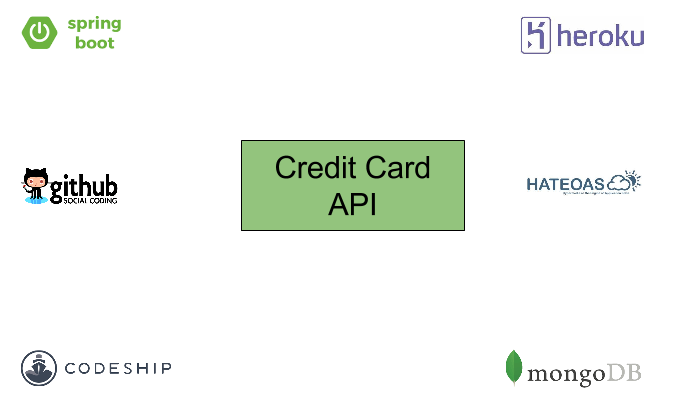
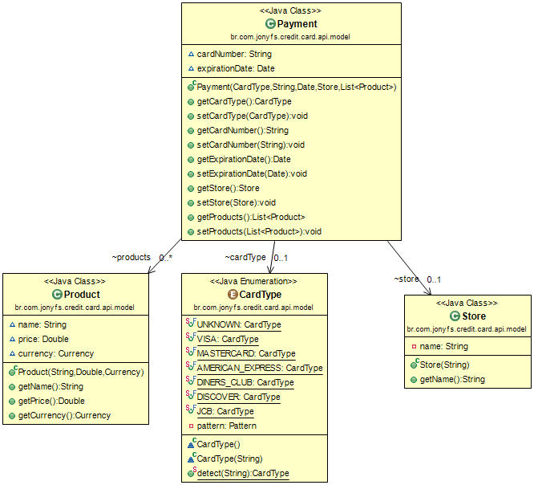
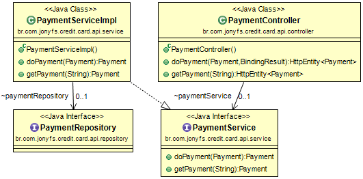
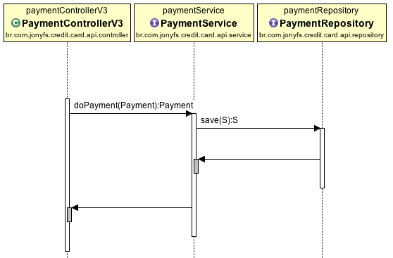
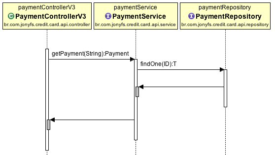

# Credit Card API Sample

	Sample with Integration Tests, Spring Boot, Embedded MongoDB, HATEOAS, Spring REST Docs and AsciiDoctor
	
	The Credit Card API uses CodeShip and Heroku to Continuous Delivery.
	 
	Codeship is a fast and secure hosted Continuous Delivery platform that scales with your needs.
	
	Heroku is a cloud application platform that offers a new way of building and deploying web apps.
		

### Model Class Diagram

### Api Class Diagram

### Api Sequence Diagram - Do Payment

### Api Sequence Diagram - Get Payment

### MongoDB Embebbed Config
* Database: credit-card
* Collections: payments
* url: localhost
* port: 27057

Obs.: I used [MongoDB Compass](https://www.mongodb.com/products/compass) client to access data in MongoDB.

### Spring Boot Config

See [application.properties](https://github.com/jonyfs/credit-card-api/blob/master/src/main/resources/application.properties) 

### Tools

[Spring Boot](http://projects.spring.io/spring-boot/)

[SPRING INITIALIZR](https://start.spring.io/)

[Spring REST Docs](http://projects.spring.io/spring-restdocs)

[MongoDB](https://www.mongodb.com/)

[embedmongo-spring](https://github.com/jirutka/embedmongo-spring)

[de.flapdoodle.embed.mongo](https://github.com/flapdoodle-oss/de.flapdoodle.embed.mongo)

[AsciiDoctor](http://asciidoctor.org/)

### AsciiDoctor file

See [credit-card-api.adoc](https://github.com/jonyfs/credit-card-api/blob/master/src/main/asciidoc/credit-card-api.adoc) 

### API Document Sample	
See [credit-card-api.pdf](https://github.com/jonyfs/credit-card-api/blob/master/doc/credit-card-api.pdf) 

### Continuous Delivery

### How test?

	Run mvn package spring-boot:run 

### How access?	

* your local environment: http://localhost:8080/api

* online: https://creditcardapi.herokuapp.com/api

	
	

