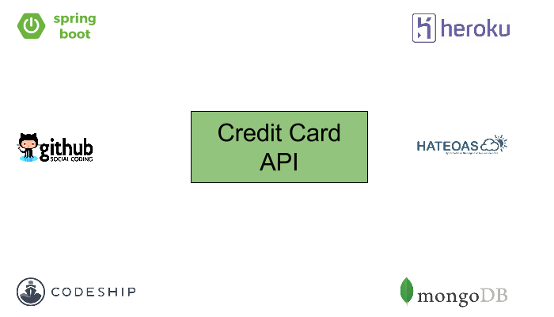
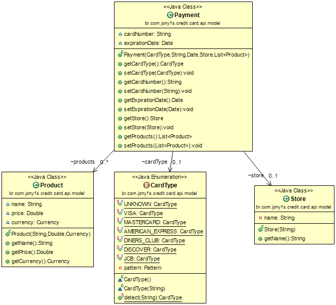
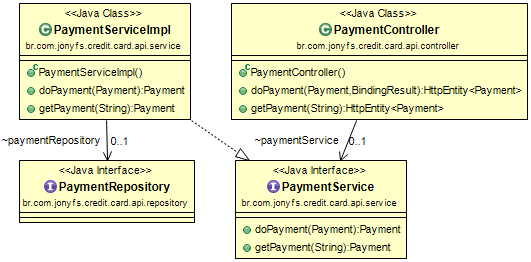
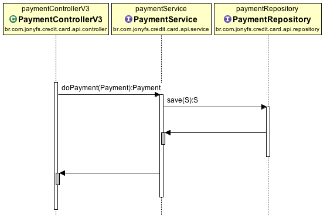
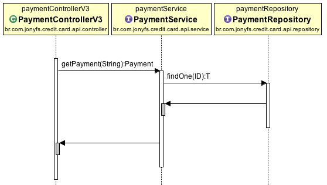

# Credit Card API Example

	Example with Integration Tests, Spring Boot, Embedded MongoDB, HATEOAS, Spring REST Docs and AsciiDoctor
	
	The Credit Card API uses GitHub Actions and Heroku for Continuous Delivery.
	



### Model Class Diagram




### Api Class Diagram




### Api Sequence Diagram - Do Payment




### Api Sequence Diagram - Get Payment




### MongoDB Config (Tests)
* In-memory MongoDB provided by [mongo-java-server](https://github.com/bwaldvogel/mongo-java-server) (no external process required for tests)
* Database: credit-card
* Collections: payments

For production, configure `spring.data.mongodb.uri` or `spring.data.mongodb.host/port/database` in `application.properties`.

Obs.: [MongoDB Compass](https://www.mongodb.com/products/compass) can be used as a GUI client.


### Spring Boot Config

See [application.properties](https://github.com/jonyfs/credit-card-api/blob/master/src/main/resources/application.properties)


### Tech Stack

| Technology | Version |
|---|---|
| Java | 21 |
| Spring Boot | 3.3.6 |
| Spring HATEOAS | 2.3.x |
| Spring REST Docs | 3.x |
| MongoDB Driver | 5.x |
| mongo-java-server (test) | 1.47.0 |
| Maven | 3.9.9 |


### Tools

[Spring Boot](http://projects.spring.io/spring-boot/)

[SPRING INITIALIZR](https://start.spring.io/)

[Spring REST Docs](http://projects.spring.io/spring-restdocs)

[MongoDB](https://www.mongodb.com/)

[mongo-java-server](https://github.com/bwaldvogel/mongo-java-server)

[de.flapdoodle.embed.mongo](https://github.com/flapdoodle-oss/de.flapdoodle.embed.mongo)

[AsciiDoctor](http://asciidoctor.org/)


### AsciiDoctor file

See [credit-card-api.adoc](https://github.com/jonyfs/credit-card-api/blob/master/src/main/asciidoc/credit-card-api.adoc) 

### API Document Sample	
See [credit-card-api.pdf](https://github.com/jonyfs/credit-card-api/blob/master/doc/credit-card-api.pdf) 

### How to build and run?

Requirements: **Java 21**, **Maven 3.9+**

```bash
mvn package spring-boot:run
```

### How to run tests?

```bash
# Unit tests only
mvn test

# All tests (unit + integration)
mvn verify
```

### How to access?

* Local: http://localhost:8080/api

* Online: https://creditcardapi.herokuapp.com/api
